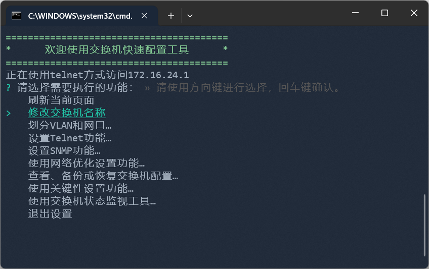

# 交换机快速配置工具

## 系统介绍

本系统是一个基于Node.js的交换机快速配置工具，通过串口或Telnet连接交换机后台，通过指令进行交换机配置，支持交换机配置文件备份及还原。

主程序为CLI程序，通过命令行进行操作（支持跨平台），并支持交互式操作，用户可以通过键盘选择各项功能，然后仅需输入必要的参数即可完成配置工作。

## 系统要求

- Node.js 14.0.0及以上版本
- Windows 10及以上版本

## 基础功能

- [x] 支持通过串口指令通信访问交换机
- [x] 支持通过Telnet指令通信访问交换机
- [x] 支持访问交换机后台并获取系统配置
- [x] 支持基本控制命令下发（包括VLAN划分，SNMP设置等）
- [x] 支持查看指令执行结果
- [x] 支持交换机重启、重置等关键性指令
- [x] 支持各类交换机状态监视指令
- [x] 内置TFTP服务器，支持交换机配置文件备份及还原
- [x] 支持操作日志自动记录